# 04 Flex布局

### 一、基本概念

* 容器（flex container）：采用 Flex 布局的元素，称为Flex容器

* 项目（flex item）它的所有子元素自动成为容器成员，称为 Flex 项目

* 容器默认存在两根轴：水平的主轴（main axis）和垂直的交叉轴（cross axis）, 项目默认沿主轴排列

  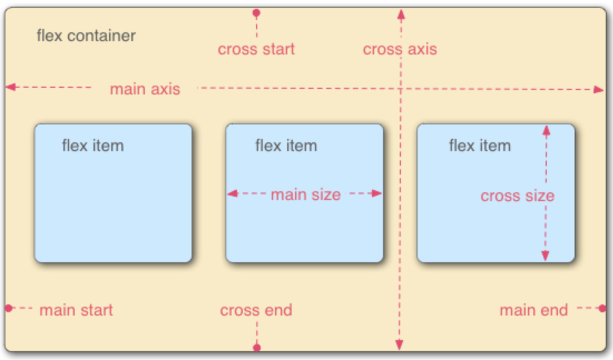 

  > 主轴的开始位置（与边框的交叉点）叫做`main start`
  >
  > 主轴结束位置叫做`main end`
  >
  > 单个项目占据的主轴空间叫做`main size`

  > 交叉轴的开始位置叫做`cross start`
  >
  > 交叉轴结束位置叫做`cross end`
  >
  > 单个项目占据的交叉轴空间叫做`cross size`

### 二、容器属性

* 以下六种属性设置于容器上

  > `flex-direction`  `flex-wrap `  `flex-flow`  `justify-content`  ` align-items`  `align-content`

* #### justify-content

  * 定义了项目在主轴上的对齐方式

  * 常见取值(图片顺序与值对应)

    ```css
  .box{
        justify-content: flex-start | flex-end | center | space-around | space-between;
  }
    ```
  
    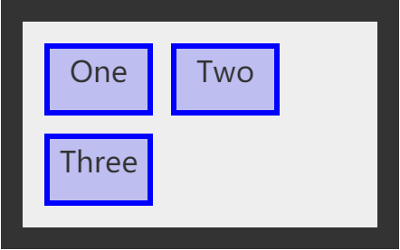 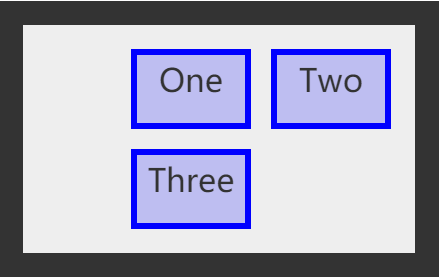 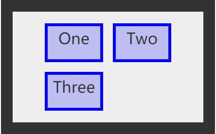 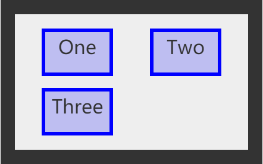 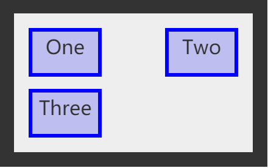 
  
    > 更多样式查阅https://developer.mozilla.org/en-US/docs/Web/CSS/justify-content

* #### align-content

  * 定义了多根轴线的对齐方式，如果项目只有一根轴线，该属性不起作用

  * 常见取值(图片顺序与值对应)

    ```css
    .box{
        align-content: start | end | center | space-around | space-between;
    }
    ```

    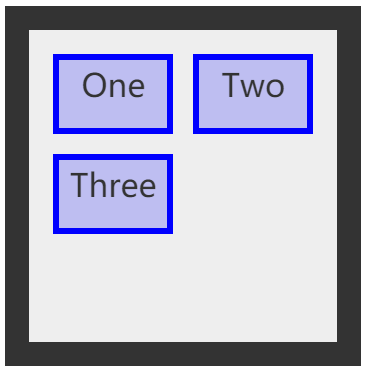 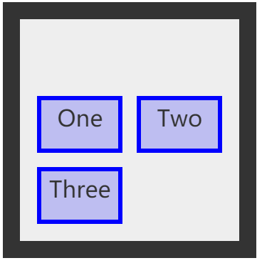 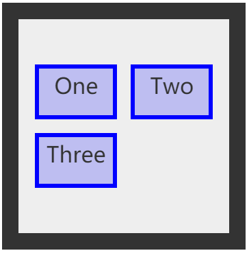 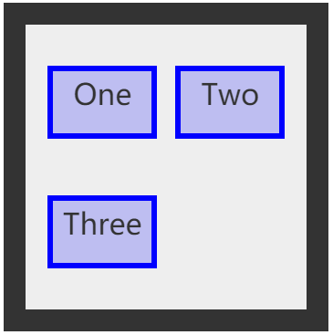 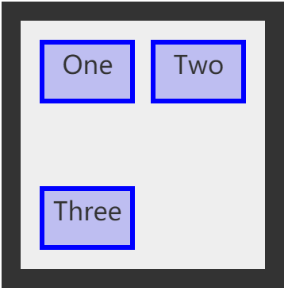

    > 更多样式查阅https://developer.mozilla.org/zh-CN/docs/Web/CSS/align-content

* #### align-items

  * 定义了项目在交叉轴上如何对齐

  * 5种取值(图片顺序与值对应)

    ```css
    .box{
    	align-items: flex-start | flex-end | center | stretch | baseline;
    }
    ```

    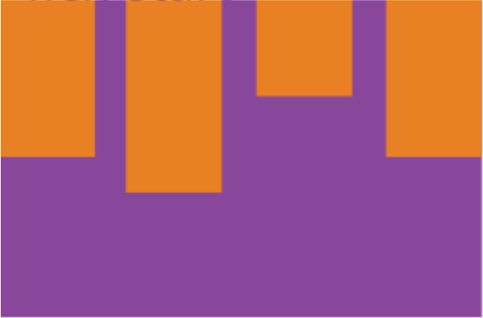  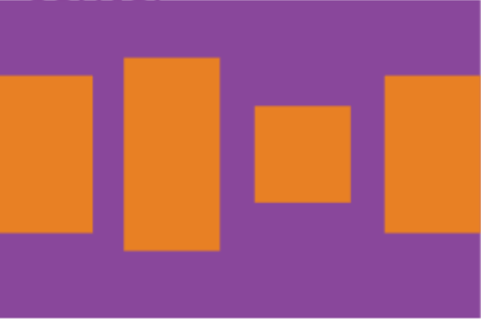 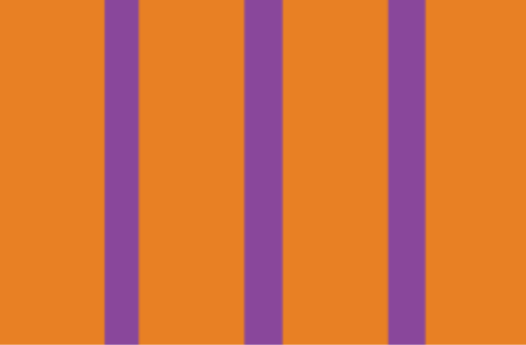 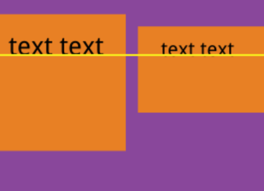

    * stretch：默认值，如果项目未设置高度或为auto将占满整个容器

* #### flex-direction

  * 属性决定主轴的方向，即项目的排列方向

  * 四种取值(图片顺序与值对应)

    ```css
    .box{
        flex-direction: row | row-reverse | column | column-reverse;
    }
    ```

    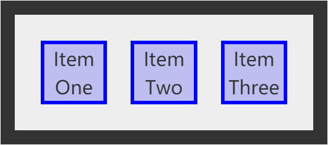 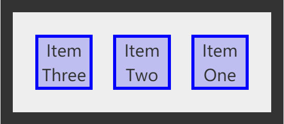 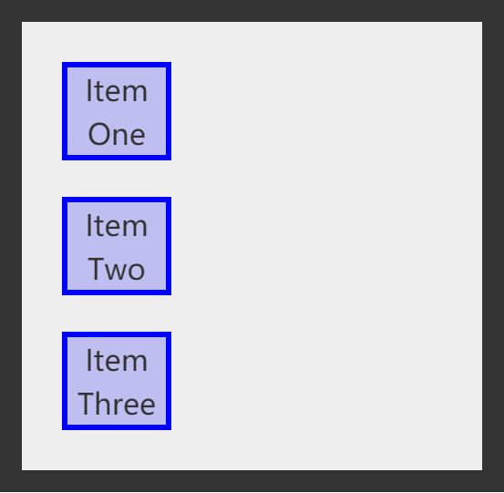 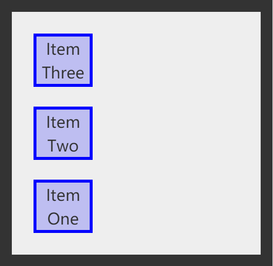

* #### flex-wrap

  * 定义如果一条轴线排不下所有项目，将如何换行

  * 三种取值（图片顺序与值对应）

    ```css
    .box{
        flex-wrap: nowrap | wrap | wrap-reverse;
    }
    ```

    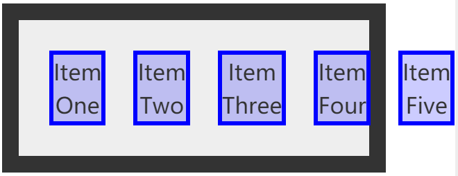 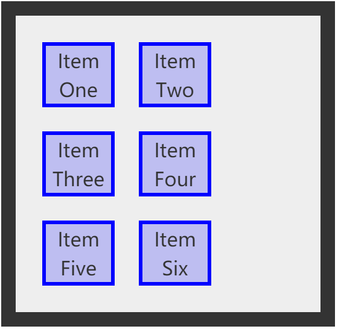  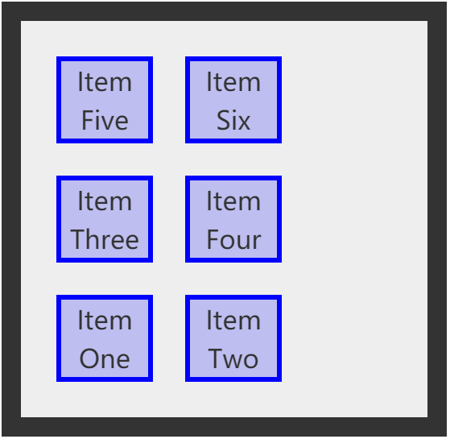 


### 三、项目属性

* 以下六种属性设置于项目上

  > `order`  `flex-grow`  `flex-shrink`  `flex-basis`  `flex`  `align-self`

* #### flex-basis

  * 定义了在分配多余空间之前，项目占据的主轴空间；根据这个属性计算主轴是否有多余空间，默认值为`auto`，即项目的本来大小

  * 赋值效果

    ```css
    .item{
        flex-basis: auto | 0 | 200px
    }
    ```

    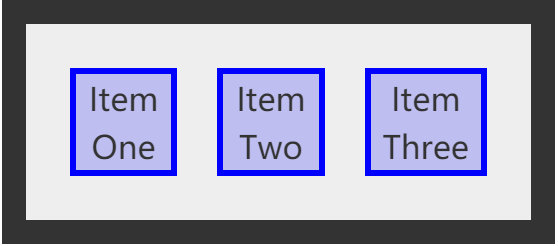 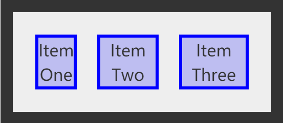 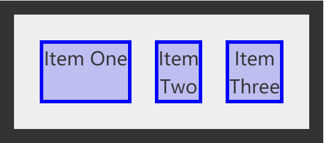 

    * 赋数字值可以看成指定width<lenth>

  * 其实没咋用过但写了我就想把它留着

* #### flex-grow

  * 定义项目的放大比例，默认为`0`，即如果存在剩余空间，也不放大

  * ```css
    .item{
        flex-grow: 1 | 2 | 0
    }
    ```

  * 如果所有项目的`flex-grow`属性都为1，则它们将等分剩余空间（如果有的话）。如果一个项目的`flex-grow`属性为2，其他项目都为1，则前者占据的剩余空间将比其他项多一倍。

    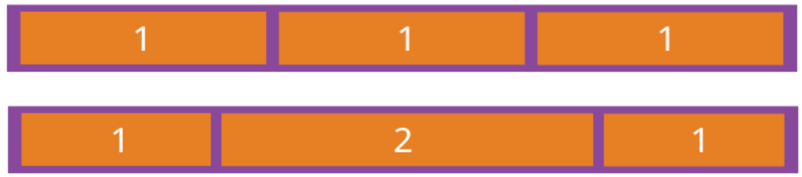 

### 四、作业

* 请在以下代码基础上，完成如图所示的效果

* **允许且仅允许使用flex布局相关的样式，请不要用padding、margin等实现**

  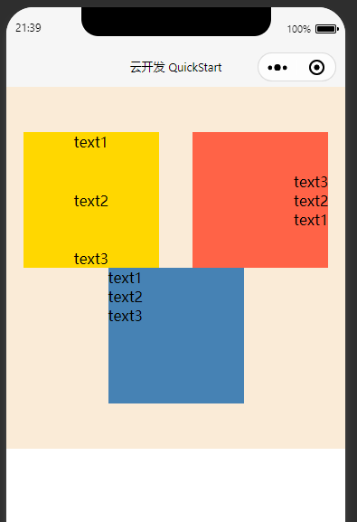

* wxml

  ```html
  <view class="box">
    <view class="item1">
      <text>text1</text>
      <text>text2</text>
      <text>text3</text>
    </view>
    <view class="item2">
      <text>text1</text>
      <text>text2</text>
      <text>text3</text>
    </view>
    <view class="item3">
      <view>text1</view>
      <view>text2</view>
      <view>text3</view>
    </view>
  </view>
  ```
  
* wxss

  ```css
  .box {
    background-color: antiquewhite;
    height: 400px;
  }
  
  .item1,
  .item2,
  .item3 {
    width: 40%;
    height: 150px;
  }
  
  .item1 {
    background-color: gold;
  }
  
  .item2 {
    background-color: tomato;
  }
  
  .item3 {
    background-color: steelblue;
  }
  
  ```