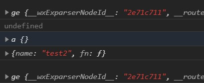

## 07	JavaScript的一些特性

**注意：**本节内容难度较大，但是非常重要，请尽可能尝试去理解。

在上一节中我们学习了JavaScript的一些基本语法，虽然对于静态网页的使用是足够的，但是一旦涉及到一些网络交互（比如向数据库请求一些信息），就会出现很多措手不及的事情。举个例子，还是feedback.js：

```javascript
onShow: function(){
    var db = wx.cloud.database().collection('feedback').get()
    console.log(db)					//会出现undefined
    wx.cloud.database().collection('feedback').get({
        success: function(res){
            console.log(res)		//会正常出现数据
        }
    })
}
```

### 1	JavaScript的异步机制

从开头的例子可以看到，JavaScript的运行过程是“异步”的，即在运行一些东西的时候会开始运行后将其挂起，进行其他的操作，等待返回结果之后再结束这个任务，这是为了保证在网络延迟较大的时候不至于对其他操作进行堵塞（例如ui的更新或者其他的实时数据计算等等）。异步操作主要出现在网络IO中（计时器是一个另类，不过也可以看做和浏览器的其他线程之间的IO）。

在深入理解异步之前，我们需要了解一下JavaScript的简单的运行机制。首先JavaScript是一种单线程运行的语言，所有需要执行的任务会被放在一个叫做“任务队列”的地方，在这个任务队列中全都是“同步”的任务（包括异步任务开头的同步部分）。每次JavaScript线程执行的时候，都会从任务队列提取一个任务，然后运行。

由于这个机制的存在，JavaScript不能通过多线程来进行异步，而只能通过将IO任务“委托”给浏览器的其他线程来达到异步的目的。由此，就有了JavaScript中就出现了一个非常重要的概念：回调函数。所谓回调函数就是当异步运行的函数结束之后，浏览器会塞进任务队列的函数，通常作为IO结束的标志以及对接收到的数据进行后续的处理。

> **补充**：如果有想了解更多一点的同学，可以参考[这篇博客](https://www.cnblogs.com/aaron---blog/p/10903118.html)，里面有对异步原理和原因的简单介绍。如果对网络请求的具体细节感兴趣，可以去参考“计算机网络”的相关书籍。

在上面的例子中的`wx.cloud.database().collection('feedback').get()`就是小程序中的一个典型网络请求，是从小程序的云数据库中请求数据。而第5行中的`success: function(res){}`就是这个请求的成功回调函数，当云数据库返回数据之后就会将这个匿名函数放入任务队列，等到此时的同步任务完成后再进行。

由于这个机制的存在，**在JavaScript中使用计时器（setTimeout或者setInterval）时，经过的时间并不是精确的**。

### 2	promise语法

JavaScript中的异步不可避免，但是如果我们希望某些东西同步进行（比如页面开始的获取数据并渲染），就需要大量的回调函数，如果对格式要求严格的话会出现非常多的缩进，是非常不雅观的。另外由于一些其他的需求，在JavaScript的ES6版本中加入了promise语法，来对JavaScript中的异步任务进行处理。

#### 2.1	创建一个promise

如果要使用promise语法的话首先要创建一个promise。JavaScript中promise的实现是将其封装为了一个Promise类，因此创建的方法是new一个对象。这句话不理解的话也可以，简而言之就是用以下的方法创建：

```javascript
var p = new Promise((resolve, reject) => {
    resolve(...)
    reject(...)
})
```

这个函数可以保证在resolve()中的函数（单个变量也算是一种变相的函数）完成后才结束promise并返回值。而reject是用来返回错误的，目前不太会用到，一般都用的是后面讲的一些东西。

举个例子：

```javascript
console.log("1")
var p = new Promise((resolve, reject) => {
    setTimeout(function(){
        resolve(console.log("2"))
    }, 1000)
})
console.log(p)	//进行状态
setTimeout(function(){console.log(p)}, 2000)	//完成状态
```

其中setTimeout是定时器函数，会在后面数字的毫秒后触发前面的回调函数。可以看到首先打印了一个状态为pending的promise，说明此promise还在进行（resolve还没结束），然后2秒之后由接下来的定时器回调函数打印了一个状态为fulfilled的promise，说明此promise已经结束（resolve已经结束）

#### 2.2	promise的方法

##### 2.2.1	.then()

.then()是最常用的promise方法，它的作用就是在上一个promise完成之后进行接下来的操作，举个例子：

```javascript
var p = new Promise((resolve, reject) => {
    setTimeout(function(){
        resolve(console.log("1"))
    }, 1000)
})
console.log("3")
p.then(() => {
    console.log("2")
})
```

会先输出3，等1秒输出1然后输出2，可以看到.then()完全把异步的步骤转换为了同步的步骤，同时也避免了频繁的回调函数造成的过多缩进。由于.then()返回的也是promise，所以可以连续.then()，将一系列异步操作完全转换为同步。

##### 2.2.2	.catch()方法

.catch()方法是用于捕捉promise进行过程中产生的错误的，如果在promise的运行过程中（包括一系列的.then()）出现错误（运行错误或者reject()），就会在最后顺延到.catch()内进行处理。

**注意：只要中间出现一次错误，中间的所有语句都不会运行，可以视为直接跳入.catch()**

##### 2.2.3	Promise.all()方法

Promise.all()是用来等待所有异步任务执行完毕的，通常用作n个不相干的异步任务，但是最后需要综合处理的情况。其使用方式为：

```javascript
var p1 = new Promise((resolve, reject) => {
    resolve(...)
})
    
var p2 = new Promise((resolve, reject) => {
    resolve(...)
})
    
var p3 = new Promise((resolve, reject) => {
    resolve(...)
})
    
Promise.all([p1, p2, p3]).then(res => {
    ...
})
```

Promise.all()的返回值为数组中所有promise的返回值组成的数组。

### 3	类与对象指向自身的方法（尽量理解）

前面讲到promise语法的实现是被封装为一个Promise类的，new是创建这个类的一个对象。事实上JavaScript中所有变量、函数等等都是继承自一个基础类的对象，所以才有类似于对象的方法和索引变量的方式（并且也因为这个运行的效率并不高）。

由于函数都是一个对象，每声明一个函数，都可以理解为声明了创造同名类的一个构造函数（虽然这个构造函数和对象是一体的）。在这个类的内部自然有能索引到自身的方法，那就是prototype；而在对象内部也有索引到对象自身的方法，那就是this。（注意类自身和对象自身并不一样，对象自身会因为调用的不同而区分，但类自身是影响由其衍生的所有对象的）

但也有例外：**所有的箭头函数`x => {}`都不会生成一个对象**，这样的话箭头函数中的this就会继承调用箭头函数的对象的this的指向。

值得注意的是，虽然每定义一个函数就会产生一个类（包括匿名函数），但是在调用函数的时候它就只是一个函数而已，而并不是以对象的形式存在的（这也就是为什么在函数中的this会指向调用它的对象），除非通过这个函数new了一个对象（把函数当做类），这时候函数作为构造函数被自己调用才能指向自己。

这么说很晕，我们来举个例子，还是在onShow里写：

```javascript
function a(){
    console.log(this)
}

var q = {
    name: "test2",
    fn: function(){
        console.log(this)
    }
}

var p = {
	name: "test",
    fn: ()=>{
        console.log(this)
    }
}

console.log(this)	//直接查看onShow这个匿名函数的this
a()					//普通函数调用
var aa = new a		//创建对象，构造函数调用
q.fn()				//匿名函数调用
p.fn()				//箭头函数调用
```

运行的结果是这样的：



可以看到除了直接调用a函数导致指向onShow匿名函数的对象而失败（注意：onShow并不是函数名）以外，其他情况都很好的符合了上述说明。

此外，有关prototype的例子可以参考本文件夹下的LinkedList.js，里面是我封装的双向链表类。

这里有一个例子，是用JavaScript实现双向链表以及它的方法的，如果对上面这些东西没有理解的话可以先跳过不看，如果感兴趣可以研究一下。具体文件就是同文件夹下的LinkedList.js。

#### 3.1	小程序中的this常见用法

如果开头讲的东西没能理解，没有关系，因为如果把情景放在小程序之后这个问题就会简单很多。

在小程序的开发中我们时常会遇到，如果我想要调用这个页面的数据或者方法，需要怎么做？比如下面这种情况：

```javascript
Page({
    data: {
        a: 1
    },
    onShow: function(){
    	//想要在这里取得a的值
	}
})
```

通用的写法就是`this.data.a`，这里的this就是指向页面（一般我们也不指向别的东西）。但是如果出现一些特殊的情况，比如：

```javascript
Page({
    data: {
        a: 1
    },
    onShow: function(){
        wx.cloud.database().collection('feedback')
            .get()
        	.then(function(res){
          		//想要在这里取得a的值  
        	})
	}
})
```

如果在这里还是使用`this.data.a`的话会报错，因为这里的this已经不是指向页面了，这时候最常见的方法也是最容易想到的方法是提前准备好一个指向页面的this，一般把它命名为that，即：

```javascript
Page({
    data: {
        a: 1
    },
    onShow: function(){
        var that = this
        wx.cloud.database().collection('feedback')
            .get()
        	.then(function(res){
          		that.data.a			//这样就能成功取到a的值 
        	})
	}
})
```

调用方法也是一样的，这里就不再赘述了，总之强烈推荐在每个页面方法的开头写上`var that = this`，免得到时候产生this错乱的情况，并且这样对于其他人来说也更容易理解。

### 4	作业

1. 利用JavaScript的定时函数setTimeout来对一个数组进行排序（数组中的元素全为Number类型且不大于100，两个数字之差不小于5）
2. 利用promise语法将上述setTimeout实现的排序改变为顺序输出（如果第一题使用for循环实现的话，请将循环改成递归）。

