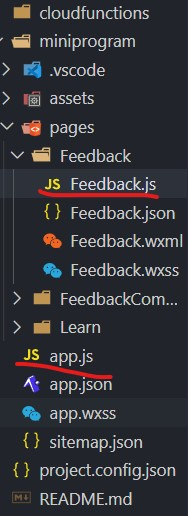
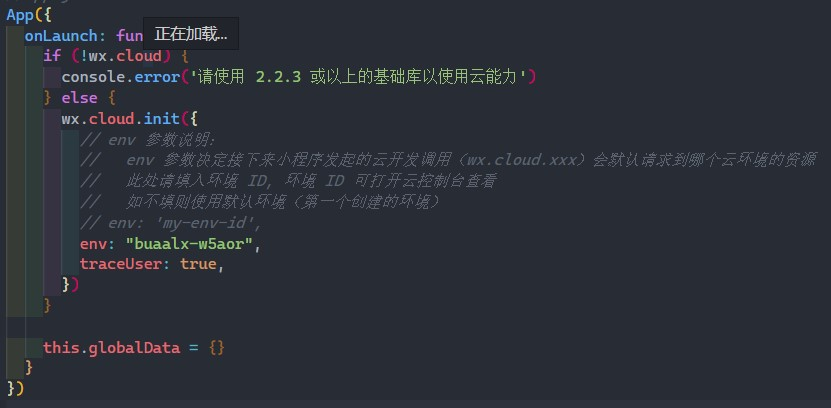

## 08	小程序中的JavaScript

### 1	.js文件

小程序中的.js文件就是JavaScript代码所在，不同于普通的html需要<script></script>标签，小程序系统内会自动将同名的.js文件在编译的时候附加到wxml编译完的html内，因此不需要多添加其他代码就可以运行到页面上。

在小程序中，每一个页面都附带有一个js文件，而整个小程序又有一个app.js全局文件。



### 2	将数据同步到页面

在小程序中，页面的数据是和data中的数据对应的，可以尝试如下的方式：

feedback.wxml:

```html
<text>{{text}}</text>
```

feedback.js:

```javascript
data: {
    text: "Hello World!"
}
```

通过调试器的wxml可以看到在写入text标签的地方，内容已经变成了Hello World!，这就说明初始的对页面的同步数据成功了。

之前也说过，通过this可以访问页面的数据，那么如果我改变this.data中的数据，能不能同步地将wxml中的数据改变呢？

我们可以更改feedback.js试试：

feedback.js：

```javascript
onShow: function() {
    this.data.text = "Goodbye!"
}
```

再次运行，发现text标签处的内容还是Hello World!，说明直接修改data是没办法达到同步数据到页面的目的的。这是因为虽然通过这样改变了数据，但是并没有触发内部引擎通过数据计算像素点的过程，因此展示到页面上还是原来的页面，而这个**改变数据触发内部引擎重新计算像素点以此达到改变页面显示**的过程，就叫做“渲染”。

所以说怎么对这个数据进行渲染？这就需要用到小程序自己的页面方法setData，使用方式参照下面的例子：

feedback.js

```javascript
onShow: function() {
    this.setData({
        text: "Goodbye!"
    })
}
```

再次运行，发现内容已经转换为了Goodbye!，就说明渲染成功了。

**再次提醒：这里的setData是页面的方法，也就是说this必须要指向页面才能生效**

### 3	对页面操作的响应

之前我们讲过了“回调函数”这一概念，对页面操作的响应正是由回调函数来实现的。

首先实现一个简单的响应：

feedback.wxml:

```html
<input ... bindinput="input">
```

feedback.js:

```javascript
Page({
    data: {
        ...
    },
    onShow:function(){
        
    },
    input: function(event){
        console.log(event.target.value)
    }
})
```

运行之后，发现每次向input标签的输入框输入内容，都会在控制台打印出**已输入的完整内容**。

分析这个例子：bindinput就是绑定与这个input标签在用户输入时触发的回调函数（这个回调函数是页面的方法），event就是触发的事件（有兴趣的同学可以将event打印出来看一下它的内容是什么，基本包含了事件的所有信息）。

**但是请注意：虽然bindinput会返回输入的数据，但是this.data并不会因此而改变，因此如果采用这种方法对输入进行处理的话，请务必第一时间通过setData向this.data同步数据**

### 4	数据绑定

通过上面两小节的方法，其实就已经可以进行交互的所有流程了，但是这么做不免有些繁琐，因为如果按照之前的方法，对于每一个input都需要绑定bindinput进行数据同步。如果对于某个数据只需要原封不动地放到data里面，微信提供了一种特殊写法“modal:value”，以对数据进行双向绑定，其写法为

```html
<input ... model:value="{{text}}">
```

这样就不需要回调函数，在需要input的输入值的时候，直接取this.data.text就可以，这极大地方便了使用。

### 5	全局

小程序中的全局变量存在在最开始说的app.js中，如果打开app.js可以看到如下的代码：



这其中this.globalData就是全局变量的声明（当然如果改成别的也可以，但这命名毕竟是官方推荐的）。虽然作为对象的性质，在任何时候想要添加属性都是没问题的，但是我仍然建议把想要添加到全局变量的属性都在这里初始化，避免出现找不到数据的错误（就算数据本身没有意义，但报错基本就完全终止了）。

同样的，全局函数也可以写在这里，推荐是写成onLaunch之外的单独的方法，这样调用起来不会不会出现this指向问题（详见上一节课中this使用例子）。

对于访问全局的数据和函数，小程序给出了一个全局的接口函数getApp()，如果我们想要存取数据或者调用函数的话，只需要用以下的写法：

```javascript
getApp().globalData.a = ...			//给全局变量a赋值
console.log(getApp().globalData.a)	//获取全局变量a的值
getApp().func()						//调用定义好的全局func函数
```

但是一般来说我们不直接写getApp()，因为这样写起来太麻烦了，一般来说都会在文件开头加上`const app = getApp()`，这样对全局变量的方法的调用获取就变成了：

```javascript
const app = getApp()
...
app.globalData.a = ...
console.log(app.globalData.a)
app.func()
```

### 6	练习

在已经写好的feedback.js的基础上添加，要求按下提交按钮的时候，控制台能打印出三个input框中填的内容，并且打印出保存在全局变量中自己的名字。


