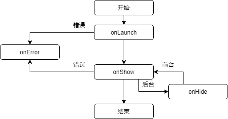
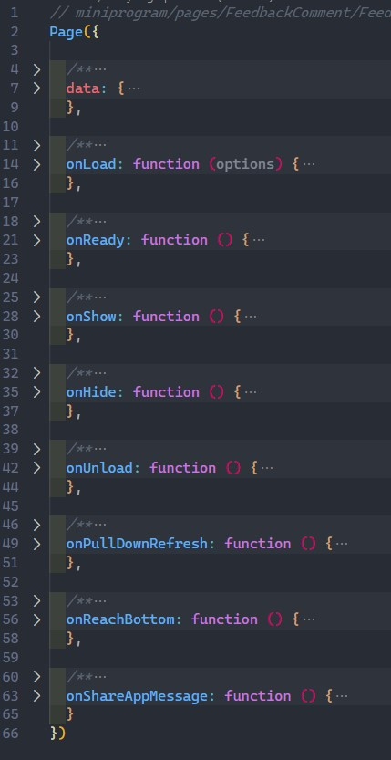

## 09	生命周期

### 1	小程序生命周期

所谓生命周期就是小程序在启动到关闭这一段时间经过的几个阶段以及触发的事件。事实上小程序的生命周期非常复杂，但是对于开发者来说微信只暴露了几个关键节点可以进行一些操作。

我们能进行操作的生命周期主要是4个：onLaunch、onShow、onHide、onError

接下来对这几个生命周期进行具体说明：

#### 1.1	onLaunch

onLaunch（加载）是在小程序刚打开的时候第一次加载时进行的，直到在后台清除小程序之前只会进行一次，上一节课中在这里进行了全局变量的初始化，此外小程序还会在这里进行云环境的初始化（涉及到后面的云函数，下一节课会细讲）。

#### 1.2	onShow

onShow（展示）是在小程序被放到手机前台的时候，也就是我们能看到并能开始操作小程序的时候触发的。这个阶段会在加载阶段后触发一次，并在每次将小程序切入后台然后切回来之后触发，主要是开启一些计时器等持续性行为，为了不占用用户的手机资源，并且避免出现错误，持续性行为需要在用户切出时关闭，在用户再切入时打开。

#### 1.3	onHide

onHide（隐藏）与onShow对应，是在小程序切入后台时触发的（切入后台不代表关闭），用处主要是关闭一些持续性的行为。除非有特殊的需求，否则一般用不到onShow和onHide这两个阶段。

#### 1.4	onError

onError（错误）是在小程序发生错误并且没有处理的时候触发的，一般用不到（有可能的错误一般在页面内就会处理，除非是微信崩了）。

总的来说，我们可以把小程序的生命周期归总为以下流程图：

当然小程序的生命周期其实并没有那么重要，比较重要的是页面的生命周期。

### 2	页面生命周期

如果直接用开发工具新建一个页面，可以看到js文件中有如下代码（这里我折叠了以下）：

这些都是小程序页面的方法，如果展开的话能看到官方给的注释，这里粘贴一下：

>  onLoad: 生命周期函数--监听页面加载
>
>  onReady: 生命周期函数--监听页面初次渲染完成
>
>  onShow: 生命周期函数--监听页面显示
>
>  onHide: 生命周期函数--监听页面隐藏
>
>  onUnload: 生命周期函数--监听页面卸载
>
>  onPullDownRefresh: 页面相关事件处理函数--监听用户下拉动作
>
>  onReachBottom: 页面上拉触底事件的处理函数
>
>  onShareAppMessage: 用户点击右上角分享

其中，onLoad、onReady、onShow、onHide、onUnload都是页面的生命周期函数。在这之中onLoad对应小程序生命周期的onLaunch，onShow与onHide分别对应，这里讲解一下onReady和onUnload。

#### 2.1	onReady

onReady会在页面初次渲染成功的时候触发，和onShow的区别主要在于onShow是每次显示页面的时候都会触发，而onReady只会触发一次。值得注意的是，在初次显示页面的时候，onShow会在onReady之前触发。

#### 2.2	onUnload

onUnload顾名思义，是在页面被卸载的时候进行触发。小程序有两种跳转页面的方式，一种是不关闭当前页面的跳转，一种是关闭当前页面的跳转，这里的“关闭”就是指“销毁”，按左上角的返回并不会回到这个页面，当页面被销毁的时候就会触发onUnload生命周期。