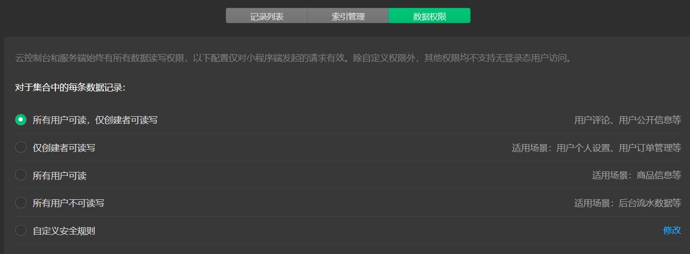
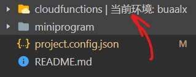
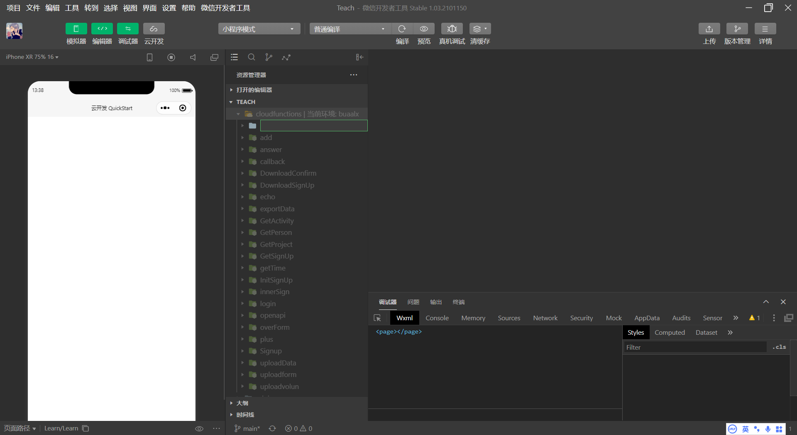
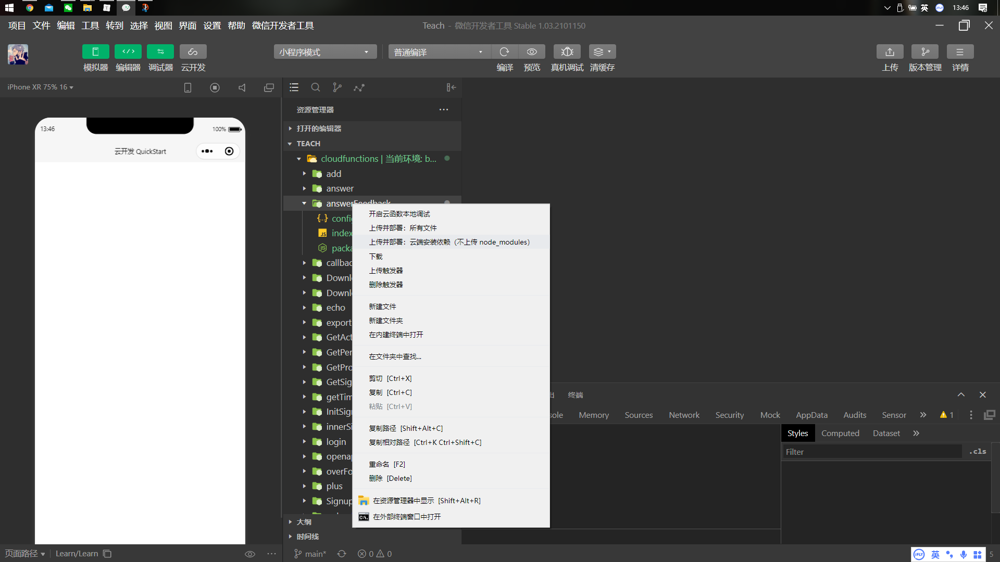
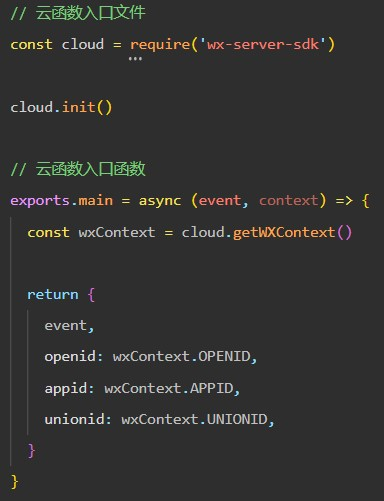

## 10	云函数开发及调用

### 1	为什么要有云函数

对于微信小程序+微信提供的云数据库这一套体系来说，只有云函数是以管理员权限操作数据库的唯一方式。

当我们打开 云开发——数据库——随便点进一个数据库——权限设置的时候，会发现这里有数据库的诸多权限，然而最开放的权限最多也仅为“创造者可读写，其他人可读”，如果我们想要达到例如回复反馈这样的功能，这些权限可能不太够。而云函数的运行环境是唯一拥有完全管理员权限的环境，因此从云函数可以进行不限制的读写，这样就能达到很多复杂的功能。



### 2	数据库操作

在说云函数之前，我们还要学习一个很重要的部分，就是小程序的数据库操作。在异步那一节中，我们举了一个很经典的数据库操作例子，用来说明JavaScript的异步特性，回顾一下那一节的内容，对数据库的请求是这样的：

```javascript
wx.cloud.dabatase().collection('feedback').get()
```

其中`wx.cloud.dabatase()`是一个固定前缀，代表访问对数据库进行操作的接口；而`collection('feedback')`则是标明操作数据库中的哪个集合，这里操作的是feedback集合；最后的`get()`就是数据库操作的方法，`get()`是从数据库中读数据。和访问全局变量一样，固定前缀我们一般也将其简化。简化后的调用方法：

```javascript
const cloud = wx.cloud
const db = cloud.database()
...
db.collection('feedback').get()
```

由于小程序中对数据库的操作十分之多，这样就可以大大减少要写的代码量。

主要的数据库操作有：add, remove, update, get分别对应增、删、改、查 （CRUD，可能有人听说过），当然增、删、查都需要配合另外的匹配方法进行，这个匹配方法就是where和doc，具体写出来就是：

```javascript
db.collection('feedback').doc(_id)/where(...).get()/remove()/update(...)
```

具体的使用方法可以参考[微信开放文档](https://developers.weixin.qq.com/miniprogram/dev/wxcloud/reference-sdk-api/database/Collection.html)，这里不作搬运了。

### 3	云函数开发

#### 3.1	同步以及新建云函数

云函数文件统一放在cloudfunctions文件夹下，每个云函数都有一个单独的文件夹。

同步云函数：打开编辑器——右键——新建文件夹——命名为“cloudfunctions”（此时文件夹会自动变黄）——右键此文件夹——当前环境——buaalx（另外一个是发布用的云环境）——等待同步云函数



创建云函数：右键cloudfunctions文件夹——新建Node.js云函数——输入云函数名称



上传云函数：右键需要上传的云函数——上传并部署：云端安装依赖（不上传node_modules）



#### 3.2	云函数编写

每一个云函数都包含一个文件夹中的三个文件：config.json、index.js、package.json。其中config.json和package.json我们平常并不需要（在编写一些定时触发的任务的时候可能需要用到config.json），而index.js是云函数运行的主体，也是要我们着重编辑的部分。

打开初始创建的index.js文件，可以发现有以下几个部分：



1. `const cloud = require('wx-server-sdk')`这句是导入微信服务器的云函数库，因为微信服务器运行的云函数和小程序不一样，因此不能直接用`wx.cloud`，而只能用这里写好的cloud。
2. `cloud.init()`这句话是对云函数进行初始化，具体写法可以参考app.js中相同语句的说明。
3. 下面的云函数入口函数，我们并不需要改变函数的调用，只需要将黄色括号内的部分换成我们自己需要的逻辑语句即可。上传到云函数的参数将会统一保存在event里。


#### 3.3	调用云函数

在小程序的js文件中调用云函数的方法如下：

```javascript
wx.cloud.callFunction({
    name: 'answerFeedback'	//云函数的名称
    data: {
    	//传入云函数的参数
	}
}).then(res => {		//res：云函数的返回值
    //调用成功后的处理
}).catch(err => {
    //调用失败后的处理
})
```

其中这里的wx.cloud一般在文件开头定义为`const cloud = wx.cloud`，这样只需要`cloud.callFunction`即可，而在云函数中调用另一个云函数的时候，因为cloud已经定义好，所以也可以这么做。

同样的，在云函数中使用数据库的方法，则需要提前写好`const db = cloud.database()`。

**前面所说的预定义都要在cloud.init()后。**

### 4	作业

1. 在之前写好的基础上，加入“按下提交键之后，将填入的数据上传到buaalx环境的feedback数据库”的功能。
2. 创建云函数，命名为：answerFeedback_xxx。其中xxx是自己姓名的首字母小写。


